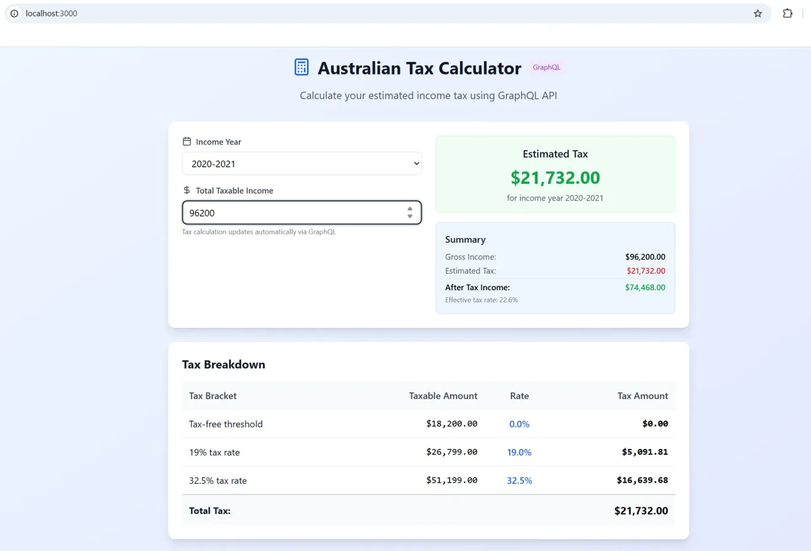
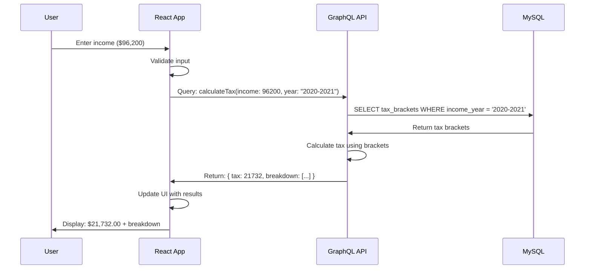
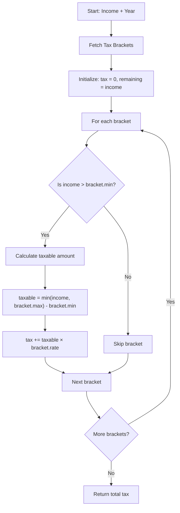
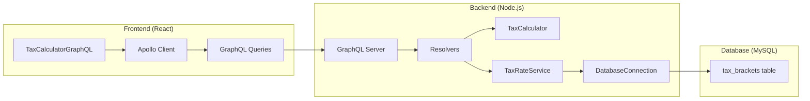

# Australian Tax Calculator

A comprehensive tax calculation system with CLI, GraphQL API, and React frontend interfaces. Built with Node.js, TypeScript, MySQL, and React.

## Table of Contents

- [Project Overview](#project-overview)
- [Architecture](#architecture)
- [Quick Start](#quick-start)
- [Tax Brackets Data](#tax-brackets-data)
- [System Workflow](#system-workflow)
- [GraphQL Operations](#graphql-operations)
- [Running Tests](#running-tests)
- [Development Guide](#development-guide)

## Project Overview

This system provides three interfaces for Australian income tax calculations:

- **CLI Interface**: Interactive command-line tool
- **GraphQL API**: Flexible API with schema introspection
- **React Frontend**: Modern web interface with real-time calculations

All interfaces use the same MySQL database and calculation logic, ensuring consistent results.

## Architecture

```
┌─────────────────┐    ┌──────────────────┐    ┌─────────────────┐
│   React App     │    │   GraphQL API    │    │     MySQL       │
│   (Port 3000)   │────│   (Port 4000)    │────│   (Port 3306)   │
│                 │    │                  │    │                 │
│ • Real-time UI  │    │ • Tax Calculator │    │ • Tax Brackets  │
│ • Apollo Client │    │ • Database Layer │    │ • User Data     │
│ • Auto-calc     │    │ • Schema & Types │    │ • Audit Trail   │
└─────────────────┘    └──────────────────┘    └─────────────────┘
                                │
                       ┌──────────────────┐
                       │   CLI Interface  │
                       │                  │
                       │ • Interactive    │
                       │ • Batch Process  │
                       │ • Same Logic     │
                       └──────────────────┘
```

## Quick Start

### Prerequisites

- Docker and Docker Compose
- Node.js 18+ (for local development)
- Git

### 1. Clone and Setup

```bash
git clone <repository-url>
cd australian-tax-calculator

# Verify directory structure
ls -la
# Should show: backend/ frontend/ docker-compose.yml
```

### 2. Start All Services

```bash
# Build and start all services
docker-compose build --no-cache
docker-compose up

# Or run in background
docker-compose up -d
```

### 3. Access the Applications

| Service | URL | Description |
|---------|-----|-------------|
| React Frontend | http://localhost:3000 | Web interface |
| GraphQL Playground | http://localhost:4000/graphql | API explorer |
| MySQL Database | localhost:3306 | Database (use MySQL client) |

### 4. Test the System

**Web Interface:**
- Open http://localhost:3000
- Enter income: `96200`
- Select year: `2020-2021`
- Expected result: `$21,732.00`

**CLI Interface:**
```bash
docker-compose exec graphql-api npm run start:cli
# Follow prompts, same inputs should give same result
```

**GraphQL API:**
- Open http://localhost:4000/graphql
- Run the example queries below

## Tax Brackets Data

### Current Tax Years Supported

The system includes Australian tax brackets for financial years 2020-2021 through 2023-2024.

| Tax Year | Status | Brackets | Notes |
|----------|--------|----------|-------|
| 2020-2021 | ✅ Active | 5 | Used in examples |
| 2021-2022 | ✅ Active | 5 | Same rates as 2020-2021 |
| 2022-2023 | ✅ Active | 5 | Same rates as 2020-2021 |
| 2023-2024 | ✅ Active | 5 | Same rates as 2020-2021 |

### Tax Brackets Structure (2020-2021 Example)

| Bracket | Income Range | Tax Rate | Description | Calculation Example (Income: $96,200) |
|---------|--------------|----------|-------------|----------------------------------------|
| 1 | $0 - $18,200 | 0% | Tax-free threshold | $18,200 × 0% = $0 |
| 2 | $18,201 - $45,000 | 19% | Low income | $(45,000 - 18,200) × 19% = $5,092 |
| 3 | $45,001 - $120,000 | 32.5% | Middle income | $(96,200 - 45,000) × 32.5% = $16,640 |
| 4 | $120,001 - $180,000 | 37% | High income | Not applicable |
| 5 | $180,001+ | 45% | Top income | Not applicable |
| | | **Total** | | **$21,732** |

### Database Schema

```sql
CREATE TABLE tax_brackets (
    id INT AUTO_INCREMENT PRIMARY KEY,
    income_year VARCHAR(9) NOT NULL,
    bracket_order INT NOT NULL,
    min_income DECIMAL(12,2) NOT NULL,
    max_income DECIMAL(12,2) NOT NULL,
    tax_rate DECIMAL(5,4) NOT NULL,
    description VARCHAR(100) NOT NULL,
    created_at TIMESTAMP DEFAULT CURRENT_TIMESTAMP,
    updated_at TIMESTAMP DEFAULT CURRENT_TIMESTAMP ON UPDATE CURRENT_TIMESTAMP,
    INDEX idx_income_year (income_year),
    UNIQUE KEY unique_year_order (income_year, bracket_order)
);
```

### Frontend Interface Example

Realtime React application that displays the current tax rates based on income



## System Workflow

### Frontend to Backend Flow



### Tax Calculation Algorithm



### Component Architecture



## GraphQL Operations

### Query Examples

#### 1. Get Supported Years
```graphql
query GetSupportedYears {
  supportedYears
}
```

**Response:**
```json
{
  "data": {
    "supportedYears": ["2020-2021", "2021-2022", "2022-2023", "2023-2024"]
  }
}
```

#### 2. Calculate Tax
```graphql
query CalculateTax($income: Float!, $year: String!) {
  calculateTax(income: $income, year: $year) {
    income
    year
    tax
    afterTaxIncome
    effectiveRate
    breakdown {
      description
      taxableAmount
      taxAmount
      rate
    }
  }
}
```

**Variables:**
```json
{
  "income": 96200,
  "year": "2020-2021"
}
```

**Response:**
```json
{
  "data": {
    "calculateTax": {
      "income": 96200,
      "year": "2020-2021",
      "tax": 21732,
      "afterTaxIncome": 74468,
      "effectiveRate": 0.226,
      "breakdown": [
        {
          "description": "19% tax rate",
          "taxableAmount": 26800,
          "taxAmount": 5092,
          "rate": 0.19
        },
        {
          "description": "32.5% tax rate", 
          "taxableAmount": 51200,
          "taxAmount": 16640,
          "rate": 0.325
        }
      ]
    }
  }
}
```

#### 3. Get All Tax Brackets
```graphql
query GetAllTaxBrackets {
  allTaxBrackets {
    id
    incomeYear
    bracketOrder
    minIncome
    maxIncome
    taxRate
    description
  }
}
```

#### 4. Health Check
```graphql
query GetHealth {
  health {
    status
    database
    timestamp
    version
  }
}
```

### Mutation Examples

#### 1. Add New Tax Year
```graphql
mutation AddTaxYear($input: TaxYearInput!) {
  addTaxYear(input: $input) {
    year
    bracketsAdded
    success
    message
  }
}
```

**Variables:**
```json
{
  "input": {
    "year": "2024-2025",
    "brackets": [
      {
        "minIncome": 0,
        "maxIncome": 18200,
        "taxRate": 0.0,
        "description": "Tax-free threshold"
      },
      {
        "minIncome": 18201,
        "maxIncome": 45000,
        "taxRate": 0.19,
        "description": "19% tax rate"
      },
      {
        "minIncome": 45001,
        "maxIncome": 120000,
        "taxRate": 0.325,
        "description": "32.5% tax rate"
      },
      {
        "minIncome": 120001,
        "maxIncome": 180000,
        "taxRate": 0.37,
        "description": "37% tax rate"
      },
      {
        "minIncome": 180001,
        "maxIncome": 999999999.99,
        "taxRate": 0.45,
        "description": "45% tax rate"
      }
    ]
  }
}
```

#### 2. Update Tax Bracket
```graphql
mutation UpdateTaxBracket($id: Int!, $input: TaxBracketInput!) {
  updateTaxBracket(id: $id, input: $input) {
    id
    incomeYear
    minIncome
    maxIncome
    taxRate
    description
  }
}
```

**Variables:**
```json
{
  "id": 1,
  "input": {
    "minIncome": 0,
    "maxIncome": 18200,
    "taxRate": 0.0,
    "description": "Updated tax-free threshold"
  }
}
```

#### 3. Delete Tax Year
```graphql
mutation DeleteTaxYear($year: String!) {
  deleteTaxYear(year: $year)
}
```

**Variables:**
```json
{
  "year": "2019-2020"
}
```

### CRUD Operations via curl

#### Create (Add Tax Year)
```bash
curl -X POST http://localhost:4000/graphql \
  -H "Content-Type: application/json" \
  -d '{
    "query": "mutation AddTaxYear($input: TaxYearInput!) { addTaxYear(input: $input) { year bracketsAdded success message } }",
    "variables": {
      "input": {
        "year": "2024-2025",
        "brackets": [
          {"minIncome": 0, "maxIncome": 18200, "taxRate": 0.0, "description": "Tax-free threshold"}
        ]
      }
    }
  }'
```

#### Read (Get Tax Brackets)
```bash
curl -X POST http://localhost:4000/graphql \
  -H "Content-Type: application/json" \
  -d '{
    "query": "query { allTaxBrackets { id incomeYear description minIncome maxIncome taxRate } }"
  }'
```

#### Update (Modify Tax Bracket)
```bash
curl -X POST http://localhost:4000/graphql \
  -H "Content-Type: application/json" \
  -d '{
    "query": "mutation UpdateTaxBracket($id: Int!, $input: TaxBracketInput!) { updateTaxBracket(id: $id, input: $input) { id description } }",
    "variables": {
      "id": 1,
      "input": {
        "minIncome": 0,
        "maxIncome": 18200,
        "taxRate": 0.0,
        "description": "Modified threshold"
      }
    }
  }'
```

#### Delete (Remove Tax Year)
```bash
curl -X POST http://localhost:4000/graphql \
  -H "Content-Type: application/json" \
  -d '{
    "query": "mutation DeleteTaxYear($year: String!) { deleteTaxYear(year: $year) }",
    "variables": { "year": "2019-2020" }
  }'
```

## Running Tests

### Backend Tests

```bash
# Run all backend tests
docker-compose exec graphql-api npm test

# Run tests with coverage
docker-compose exec graphql-api npm test -- --coverage

# Run specific test file
docker-compose exec graphql-api npm test -- tax-calculator.test.ts

# Run tests in watch mode
docker-compose exec graphql-api npm test -- --watchAll
```

### Frontend Tests

```bash
# Run React component tests
docker-compose exec frontend npm test

# Run with coverage
docker-compose exec frontend npm test -- --coverage --watchAll=false
```

### Test Scenarios Covered

#### Backend Tests
- **Tax Calculation Logic**
  - Zero tax for income below threshold
  - Correct tax for various income levels
  - Bracket boundary conditions
  - High income scenarios
  - Rounding behavior

- **Database Operations**
  - Tax bracket retrieval
  - Year validation
  - CRUD operations
  - Error handling

- **GraphQL Resolvers**
  - Query execution
  - Mutation handling
  - Error responses
  - Schema validation

#### Example Test Results
```bash
Test Suites: 3 passed, 3 total
Tests:       24 passed, 24 total
Snapshots:   0 total
Time:        2.341 s

Coverage Summary:
File                   | % Stmts | % Branch | % Funcs | % Lines
-----------------------|---------|----------|---------|--------
tax-calculator.ts      |   98.5  |   95.2   |  100.0  |  98.1
tax-rate-service.ts    |   94.3  |   88.9   |  100.0  |  93.8
graphql/resolvers.ts   |   92.1  |   85.7   |   95.8  |  91.4
```

## Development Guide

### Local Development Setup

#### Backend Development
```bash
# Start dependencies only
docker-compose up mysql

# Run backend locally
cd backend
npm install
npm run dev:graphql
```

#### Frontend Development
```bash
# With backend running
cd frontend
npm install
npm start
```

### Adding New Tax Years

1. **Via GraphQL Mutation** (Recommended)
```bash
# Use the AddTaxYear mutation shown above
```

2. **Direct Database Insert**
```sql
INSERT INTO tax_brackets (income_year, bracket_order, min_income, max_income, tax_rate, description) VALUES
('2025-2026', 1, 0.00, 18200.00, 0.0000, 'Tax-free threshold'),
('2025-2026', 2, 18201.00, 45000.00, 0.1900, '19% tax rate');
-- ... continue for all brackets
```

3. **Using the Seeding Script**
```bash
docker-compose exec graphql-api npm run db:seed
```

### Project Structure

```
australian-tax-calculator/
├── docker-compose.yml
├── README.md
├── backend/
│   ├── src/
│   │   ├── graphql/
│   │   │   ├── typeDefs.ts
│   │   │   └── resolvers.ts
│   │   ├── database/
│   │   │   └── connection.ts
│   │   ├── __tests__/
│   │   ├── tax-calculator.ts
│   │   ├── tax-rate-service.ts
│   │   ├── index.ts (CLI)
│   │   └── graphql-server.ts
│   ├── sql/
│   │   └── init.sql
│   ├── package.json
│   └── Dockerfile.graphql
└── frontend/
    ├── src/
    │   ├── components/
    │   │   └── TaxCalculatorGraphQL.tsx
    │   ├── graphql/
    │   │   ├── client.ts
    │   │   └── queries.ts
    │   └── App.tsx
    ├── package.json
    ├── Dockerfile
    └── nginx.conf
```

### Common Commands

```bash
# Full system restart
docker-compose down -v --remove-orphans
docker-compose build --no-cache
docker-compose up

# View logs
docker-compose logs -f graphql-api
docker-compose logs -f frontend

# Access containers
docker-compose exec graphql-api sh
docker-compose exec frontend sh

# Database access
docker-compose exec mysql mysql -u taxapp -p tax_calculator
```

### Troubleshooting

#### Common Issues

1. **Port Conflicts**
   - Change ports in docker-compose.yml if 3000, 4000, or 3306 are in use

2. **Database Connection Failed**
   - Ensure MySQL container is healthy: `docker-compose ps`
   - Check logs: `docker-compose logs mysql`

3. **GraphQL Introspection Disabled**
   - Verify `NODE_ENV=development` in docker-compose.yml
   - Restart services: `docker-compose restart graphql-api`

4. **Frontend Can't Connect to API**
   - Check `REACT_APP_GRAPHQL_URL` environment variable
   - Verify GraphQL server is running on port 4000

### Performance Notes

- React frontend caches GraphQL results via Apollo Client
- MySQL indexes optimize tax bracket queries
- Docker volumes persist database data between restarts
- Multi-stage Docker builds minimize image sizes

## Contributing

1. Fork the repository
2. Create feature branch: `git checkout -b feature/new-feature`
3. Add tests for new functionality
4. Ensure all tests pass: `npm test`
5. Submit pull request with clear description

## License

MIT License - see LICENSE file for details.