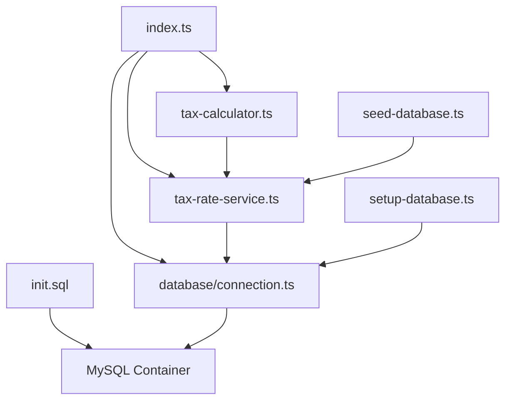

# Australian Tax Calculator - MySQL Edition

## Project Structure

australian-tax-calculator/
├── package.json
├── tsconfig.json
├── jest.config.js
├── Dockerfile
├── .dockerignore
├── README.md
└── src/
    ├── index.ts
    ├── tax-calculator.ts
    ├── tax-rate-service.ts
    └── __tests__/
        ├── tax-calculator.test.ts
        └── tax-rate-service.test.ts

```
australian-tax-calculator-mysql/
├── 📁 Root Configuration Files
│   ├── package.json                    # Node.js dependencies and scripts
│   ├── tsconfig.json                   # TypeScript configuration
│   ├── jest.config.js                  # Jest testing configuration
│   ├── .env                           # Environment variables (local development)
│   ├── .dockerignore                  # Docker ignore patterns
│   └── README.md                      # This documentation file
│
├── 📁 Docker Configuration
│   ├── docker-compose.yml             # Multi-container Docker setup
│   ├── Dockerfile                     # Application container definition
│   └── docker-entrypoint.sh          # Container startup script
│
├── 📁 Database Files
│   └── sql/
│       └── init.sql                   # Database schema and initial data
│
├── 📁 Source Code
│   └── src/
│       ├── index.ts                   # Main application entry point
│       ├── tax-calculator.ts          # Core tax calculation logic
│       ├── tax-rate-service.ts        # Database service layer
│       │
│       ├── 📁 database/
│       │   └── connection.ts          # MySQL connection management
│       │
│       ├── 📁 scripts/
│       │   ├── setup-database.ts      # Database schema setup
│       │   └── seed-database.ts       # Additional data seeding
│       │
│       └── 📁 __tests__/
│           ├── setup.ts               # Test environment setup
│           ├── tax-calculator.test.ts # Calculator unit tests
│           └── tax-rate-service.test.ts # Service unit tests
│
└── 📁 Generated Files (after build)
    ├── dist/                          # Compiled JavaScript output
    ├── node_modules/                  # Node.js dependencies
    └── coverage/                      # Test coverage reports
```

## File Descriptions

### Root Configuration Files

| File | Purpose | Description |
|------|---------|-------------|
| `package.json` | Dependencies | Node.js project configuration, dependencies, and npm scripts |
| `tsconfig.json` | TypeScript | TypeScript compiler configuration and build settings |
| `jest.config.js` | Testing | Jest test runner configuration and coverage settings |
| `.env` | Environment | Local development environment variables (database connection) |
| `.dockerignore` | Docker | Files to exclude from Docker build context |

### Docker Configuration

| File | Purpose | Description |
|------|---------|-------------|
| `docker-compose.yml` | Orchestration | Multi-container setup (MySQL + Application) |
| `Dockerfile` | Container | Application container definition and build steps |
| `docker-entrypoint.sh` | Startup | Container startup script with MySQL wait logic |

### Database Files

| File | Purpose | Description |
|------|---------|-------------|
| `sql/init.sql` | Schema | Database tables, indexes, initial tax data, and views |

### Source Code Files

| File | Purpose | Description |
|------|---------|-------------|
| `src/index.ts` | Main App | CLI interface, user interaction, and application flow |
| `src/tax-calculator.ts` | Core Logic | Tax calculation algorithms and breakdown generation |
| `src/tax-rate-service.ts` | Data Layer | Database operations for tax bracket management |
| `src/database/connection.ts` | Connection | MySQL connection singleton with error handling |
| `src/scripts/setup-database.ts` | Setup | Database schema initialization script |
| `src/scripts/seed-database.ts` | Seeding | Additional data insertion utilities |

### Test Files

| File | Purpose | Description |
|------|---------|-------------|
| `src/__tests__/setup.ts` | Test Setup | Global test configuration and mocks |
| `src/__tests__/tax-calculator.test.ts` | Unit Tests | Tests for tax calculation logic |
| `src/__tests__/tax-rate-service.test.ts` | Unit Tests | Tests for database service operations |

## Key Features by File

### 📊 Database Layer (`sql/init.sql`)
- **Tax Brackets Table**: Stores all tax years and brackets
- **Indexed Queries**: Optimized for fast tax bracket lookups
- **Data Integrity**: Constraints ensure valid tax data
- **Summary View**: Easy-to-read tax bracket overview

### 🧮 Core Logic (`src/tax-calculator.ts`)
- **Progressive Tax Calculation**: Accurate bracket-based calculations
- **Tax Breakdown**: Detailed breakdown by tax bracket
- **Async Operations**: Database-backed calculations
- **Error Handling**: Robust error management

### 🔌 Data Service (`src/tax-rate-service.ts`)
- **CRUD Operations**: Create, read, update tax years
- **Transaction Support**: Safe multi-operation database updates
- **Connection Management**: Efficient database connection handling
- **Validation**: Data integrity checks

### 🖥️ User Interface (`src/index.ts`)
- **Interactive CLI**: User-friendly command-line interface
- **Input Validation**: Robust input checking and error messages
- **Formatted Output**: Professional currency formatting
- **Database Status**: Connection testing and error reporting

### 🐳 Docker Setup (`docker-compose.yml`)
- **MySQL Container**: Pre-configured database with health checks
- **App Container**: Node.js application with automatic startup
- **Volume Management**: Persistent database storage
- **Network Configuration**: Container-to-container communication

## Development Workflow Files

### Package Scripts (`package.json`)
```bash
npm run build          # Compile TypeScript to JavaScript
npm start              # Run the compiled calculator
npm run dev            # Development mode with hot reload
npm test               # Run all unit tests
npm run db:setup       # Initialize database schema
npm run db:seed        # Add additional tax years
npm run docker:up      # Start Docker services
npm run docker:down    # Stop Docker services
npm run docker:logs    # View container logs
```

### Environment Configuration (`.env`)
```bash
# Database connection settings
DB_HOST=localhost          # MySQL host
DB_PORT=3306              # MySQL port
DB_NAME=tax_calculator    # Database name
DB_USER=taxapp            # Database user
DB_PASSWORD=taxpassword123 # Database password
```

## File Dependencies



## Adding New Files

### For New Tax Years
1. Update `sql/init.sql` with new INSERT statements, or
2. Use `src/scripts/seed-database.ts` to add programmatically

### For New Features
1. Add source files in appropriate `src/` subdirectories
2. Create corresponding test files in `src/__tests__/`
3. Update `package.json` if new dependencies are needed
4. Add new npm scripts if required

### For New Environments
1. Create environment-specific `.env` files (`.env.production`, `.env.staging`)
2. Add corresponding Docker Compose overrides (`docker-compose.prod.yml`)

This structure follows clean architecture principles with clear separation of concerns, making the codebase easy to maintain and extend for annual tax rate updates.